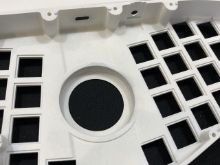
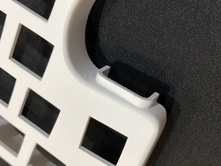
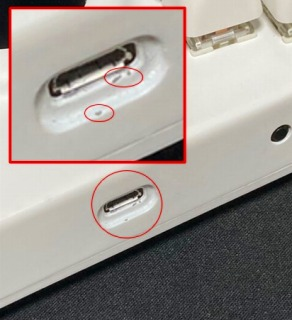
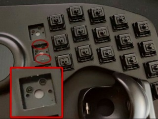
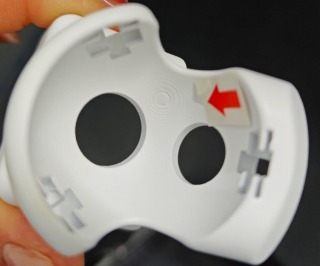
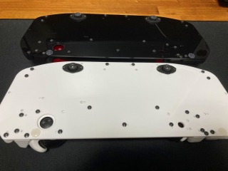

## 購入前の注意点

omni kbdシリーズをご購入いただく前に、以下の点をご確認ください。  

### 1. 製品について
- 本キットは ご自身ではんだ付けを行い、組み立てる **「自作キーボードキット」** です。完成品ではありません。  
- 仕様は予告なく変更になる場合があります。また、変更前後での互換性もなくなる可能性があります。  
- 詳細は販売ページをご確認下さい。  

### 2. ケースについて
- 3Dプリント品のためケースにひずみがある場合があります。(使用上は問題のないようにしています。)  
- 塗装は外観面のみとなります。組み立て後に見えない箇所は塗装がない場合があります。  
      

- その他、細かい傷や塗装ムラなどがある場合があります。  
       

- スイッチを交換した際に、塗装部が剥がれる場合があります。  
  ケース素材が白色のため、特に黒塗装の場合目立ちます。  
  ただし、確認済みのケースでは、スイッチ、キーキャップを付けると見えなくなります。  
  (上記について、保証は出来ません。気になる場合は同系色のペンなどでレタッチしてください。)  
      

- 場所によっては積層痕が目立つ箇所があります。  
      

- 白塗装品について、黒い擦れたあとがある場合があります。  
  確認済みのケースではすべて消しゴムで擦ることでとれています。  
  外観面の確認はしていますが、軽微な物まで全て除去することは難しいです。  
  許容できない痕がある場合は、ディスコードのサポートチャンネルかXのDMでご相談ください。  

- ボトムプレートは片面マットのアクリルを使用しています。  
  写真では分かり難いですが、裏側は光沢があります。  
  (見えない面ですが、黒アクリルの光沢面はほこりなどが目立ちます)  
      
    
- ご自身で塗装したい場合は塗装レスケースの対応を検討するので、ディスコードのサポートチャンネルかXのDMでご相談ください。  

### 3.タッチディスプレイについて
- タッチディスプレイの描画の更新とトラックボールの操作を同時に行うとカーソルが飛ぶなど意図しない動作が起こります。  
  (描画とトラックボールセンサーの更新を同時に行うことができないためです。)  
  例として、  
  右トラックボールを動かしながらタッチディスプレイのレイヤーを変更すると、  
  カーソルの動作が飛んだような挙動をします。  
  同時に行うことは想定していませんが行いたい場合はファームウェアで描画の更新を停止することで、  
  同時操作を行うことは可能です。

### 4. その他の注意点など
- **ファームウェアの更新**：ファームウェアは適宜アップデートしていきます。アップデート時は下記にご留意ください。  
  - トラックボールのチューニングは再度必要になる場合があります。  
  - 互換性のないアップデートとなる可能性があります。  
    (キーマップなども再設定の必要となる場合があります。)  
- 組み立てに不安がある方は購入前にディスコードのサポートチャンネルにご連絡ください。  
  ※どの作業に不安があるか具体的にご連絡いただければ、解消できないか対応を検討します。  

