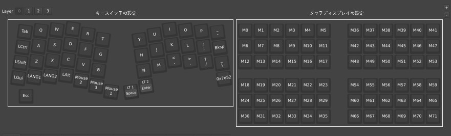
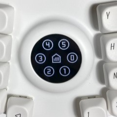
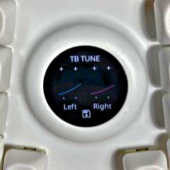
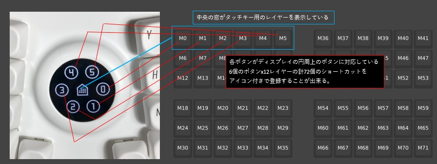
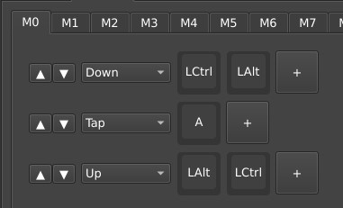
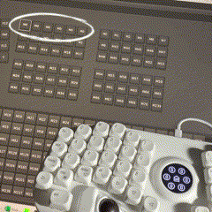

## omni kbd Readme
omni kbdはデュアルトラックボールを搭載した一体型40%キーボードの自作キットシリーズです。
キーボードの特徴、使い方、設定方法などを紹介します。
 
 購入前の注意点として [購入前の注意点](notice.md) をご確認下さい。

---
### omni kbdシリーズについて

**omni CS** 
- 配列：カラムスタッガード
- メイントラックボール：44mm(オプション 34mm)
- サブトラックボール：25mm
- タッチディスプレイ：有り
- スイッチ：cherryMX
- [shop](https://masskb.booth.pm/items/6487849)
  
キー入力やマウスの操作性に重きを置いています。
デスク上に据え置き「あらゆるPC作業を効率的にこなす」をコンセプトに設計しています。

**omni orth** 
- 配列：オーソリニア
- 左右トラックボール：25mm
- タッチディスプレイ：有り
- スイッチ：lofree low profile、choc v1
  
トラックボールは左右ともに25mmを採用しています。
打鍵感と操作性のバランスを重視して設計しています。
ロープロファイル専用設計です。

**omni row** 
- 配列：ロウスタッガード
- 左右トラックボール：サイズ未定
- タッチディスプレイ：未定
- スイッチ：未定

---
### キーマップ
キーマップは[Vial](https://vial.rocks/)で変更できます。
Vialの使い方については、解説記事も多いことや、機能が多岐にわたり書ききれないので、公式サイトや他のblogなどを参考にして貰えたらと思います。
 

---

### タッチディスプレイについて(omni CS、omni orth)
タッチディスプレイは下記のモードに変更することができます。
- タッチキーモード
 

- トラックボールチューニングモード
  


起動時はタッチキーモードで起動します。
ディスプレイを3秒程度長押しすると、モードが切り替わります。
※長押しを続けるとモードが連続で切り替わります。切り替えたいモードで指を話してください。

---

### タッチキーモード
通常のキー同様にタッチディスプレイにキー入力を登録することができます。
  

**キーの設定**
レイヤー0に登録することでタッチディスプレイにキーを登録できます。  
Vialでマクロを登録することで、ショートカットとして使うことができます。  
  

                
**アイコンの設定**
レイヤー1にマクロキーを設定することで登録済みのアイコンを呼び出すことができます。
マクロキーはあらかじめ0~254まで領域が用意してあります。

~199：デフォルト領域です。特定の番号までアイコンが登録されています。  
キーとアイコンの対応は[こちら](icon.md)をご確認ください。
デフォルト領域に追加してほしいアイコンがあれば、ディスコードまでご連絡下さい。空きがある間は可能であれば追加します。
(licenseを満たさないもの、製品コンセプトにあわないものなどはお断りする場合があります。)

200~254：カスタマイズ領域です。ファームウェアを書きかえることで好きなアイコンを登録することが出来ます。
  

---

### トラックボールチューニングモード
トラックボールの操作速度に応じて、移動量と速度の調整ができます。
下図のグラフのように傾きと変化度合い(カーブ具合)を調整することで、低速側と高速側のバランスを調整できます。
  

調整手順
1. 各トラックボールの右側の±をタッチし最高速度を調整します。
2. 各トラックボールの左側の±をタッチしカーブを変更することで、低速側と高速側のバランスを調整します。
3. 低速/高速の操作感がよくなるまで1,2を繰り返します。
4. 💾ボタンを押すと設定が保存されます。


---

### アイコンの新規登録(ファームウェアの作成が必要)
タッチキーに使うアイコンの登録が出来ます。※Vialファームウェアをビルドする必要があります。

1. アイコンに使いたい画像を用意します。(推奨サイズ64x64、フォルダパスは「omni_kbd/icon」直下にいれて下さい。)
2. QMK MSYSのcdコマンドを使い、上記の「omni_kbd/icon」フォルダに移動します。
3. QMK MSYSで下記コマンドを実行します。(200.pngの画像をアイコン化する場合)
   ``` shell
   // 白黒
   qmk painter-convert-graphics -f mono2 -i 200.png -o ./generated/
   // フルカラー
   qmk painter-convert-graphics -f rgb565 -i 200.png -o ./generated/
   ```
4. generatedフォルダに表示用データが保存されます。
5. omni_cs/rules.mkにSRC += ../icon/generated/200.qgf.cを追加します。
6. icon/omni_image_loader.cに#include "icon/generated/200.qgf.h"とimage_200 = qp_load_image_mem(gfx_200);を追加します。
   ※どちらとも類似のコードがあるので、その直後に追加してください。
7. ファームウェアをbuildします。
※画像データは200~254までが、空き番地としてファームウェアに用意されているのでそちらをお使いください。
0~199番も不要であれば上書きしても問題はないです。

#### 起動時の表示画像(gif)の設定
1. アイコンに使いたいgif画像を用意します。(サイズ240x240、フォルダパスは「omni_kbd/icon」直下にいれ、ファイル名は「omni_logo.gif」にして下さい。)
2. QMK MSYSのcdコマンドを使い、上記のフォルダに移動します。
3. 下記コマンドを実行します。
   ``` shell
    qmk painter-convert-graphics -f mono2 -i omni_logo.gif -o ./generated/
   ```   
4. generatedフォルダに表示用データが保存されます
5. ファームウェアをbuildします。
6. マイコンにファームウェアを入れるときは、容量がマイコンの容量に対し余裕があるか確認してから入れてください。

#### サポートやアイデア
[Discode](https://discord.gg/dQM3sVPgT6)にて、omni kbdシリーズのコミュニティを作成しました。
サポートが必要な場合や、omni kbdシリーズについてのご相談はコミュニティにて受け付けています。
※返信がない場合は、[X](https://x.com/mass_0X00)にDM等でご連絡下さい。


